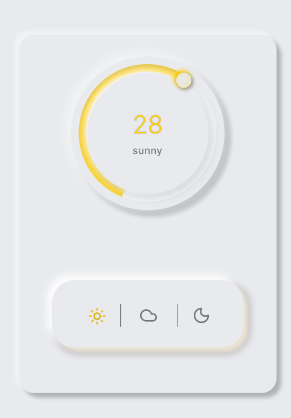

# 🌦️ Neomorphic Weather UI Replicated

An interactive, high-fidelity replication of a stunning Neomorphic weather dashboard I found online. Built from scratch to master complex CSS lighting, advanced SVG dynamics, and precise layout engineering.

---

## Built in Figma 



---

## 🛠️ Tech Stack & Tools

* **Reference Concept**: Neomorphic Weather UI (Found online)
* **Framework**: React + TypeScript (TSX)
* **Styling**: Tailwind CSS
* **Icons**: Lucide React
* **Build Tool**: Vite

---

## 🚀 Getting Started Locally

Bring this interactive interface to life on your local machine in just two steps:

```bash
# 1. Install all dependencies
npm install

# 2. Spin up the Vite local development server
npm run dev